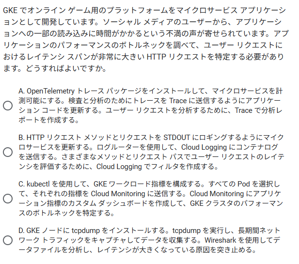
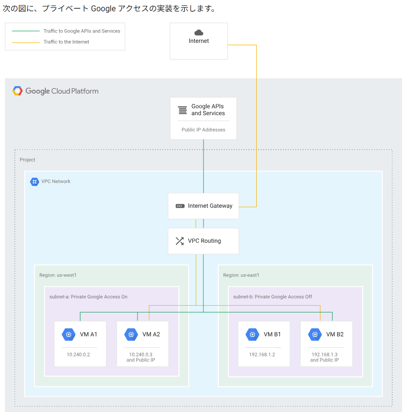

OpenTelemetry トレース パッケージをインストールして、マイクロサービスを計測可能にする。検査と分析のためにトレースを Trace に送信するようにアプリケーション コードを更新する。ユーザー リクエストを分析するために、Trace で分析レポートを作成する。
これが、ユーザー リクエストのレイテンシ スパンをキャプチャする場合に Google が推奨するアプローチです（https://cloud.google.com/trace/docs/analysis-reports）。

GKE でアプリケーションをホストし、Cloud Load Balancing と Google マネージド証明書で Identity-Aware Proxy（IAP）を使用する。

Cloud Run functions の関数をトリガーするサービスで HTTP 500 エラーが発生していることがわかりました。メールの不達を最小限にするためにメールの処理方法を変更する必要があります。どうすればよいですか。

問題は、新しい Cloud Run functions の関数インスタンスの作成を待っている間に、インバウンド トラフィックが急増してリクエストがタイムアウトすることで発生しています。

Cloud Spanner はトランザクション向け
の高性能データベース。

Cloud Build は、複数のビルドを並行して実行できます。複数の開発者が複数の commit を行うと、複数のビルドが同時に実行されて、結果に影響が出る可能性があります。

新しいプロジェクトを作成し、必要なデータを読み込む。テストの完了後にそのプロジェクトを削除する。
は不正解です。プロジェクトの作成にはレート制限があり、組織内で高度な権限が付与されている必要もあります。

 Cloud Build で自動的にパフォーマンス テストが実行されるようにしたい
 は不正解です。エミュレータは実際のサービスと同じスケーラビリティ / パフォーマンスの特性を備えていません。

 ===
 インターネットで公開するマイクロサービス アプリケーションを GKE にデプロイする必要があります。A/B テスト手法を使用して、新機能を確認したいと考えています。新しいコンテナ イメージ リリースをデプロイするにあたって、以下の要件があります。

1. 新しいコンテナ イメージをデプロイする際のダウンタイムをゼロにする。
2. 本番環境の新規リリースについては、本番環境ユーザーのサブセットを使用してテストと検証を行う。

どうすればよいですか。

=============
28問間違い / 52問中

=============
インターネットで公開するマイクロサービス アプリケーションを GKE にデプロイする必要があります。A/B テスト手法を使用して、新機能を確認したいと考えています。新しいコンテナ イメージ リリースをデプロイするにあたって、以下の要件があります。

1. 新しいコンテナ イメージをデプロイする際のダウンタイムをゼロにする。
2. 本番環境の新規リリースについては、本番環境ユーザーのサブセットを使用してテストと検証を行う。

どうすればよいですか。

A. 1. コンテナ バージョンを最新バージョンに置き換えることで、Deployment マニフェスト ファイルを更新するように CI / CD パイプラインを構成する。2. Deployment マニフェスト ファイルを適用して、クラスタに Pod を再作成する。3. アプリケーションの機能を前回のリリース バージョンと比較してアプリケーションのパフォーマンスを検証し、問題が発生した場合はロールバックする。
B. 1. GKE クラスタに Cloud Service Mesh をインストールする。2. GKE クラスタに Deployment を 2 つ作成し、それぞれに異なるバージョン名のラベルを付ける。3. 重み付けに基づくトラフィック分割アクションを構成して、新しいバージョンのアプリケーションを参照する Deployment に少ない割合のトラフィックを送信する。
C. 1. GKE に新しいリリース バージョンの 2 番目の Namespace を作成する。2. 必要な数の Pod で 2 番目の Namespace の Deployment 構成を作成する。3. 2 番目の Namespace に新しいコンテナ バージョンをデプロイする。4. 新しいコンテナ バージョンで Namespace にトラフィックを転送するように上り（内向き）構成を更新する。
D. 1. Pod を徐々に新しいリリース バージョンに置き換えていくことで、ローリング アップデート パターンを実装する。2. ロールアウト中にユーザーの新しいサブセットを対象にアプリケーションのパフォーマンスを検証し、問題が発生した場合はロールバックする。

ーーー
- 通話時間が 1～30 分の範囲内であること。
- 通話は通常、営業時間内に発生していること。
- ある決まった日付（たとえば、給料日）を含めた前後数日や、大規模な給与変更が発生したときに、通話が大幅に急増すること。

費用、労力、運用オーバーヘッドを最小限に抑えたいと考えています。どこにバックエンド アプリケーションをデプロイすればよいですか。

A は正解です。Cloud Run は、最大 60 分のセッションと gRPC をサポートし、ゼロにスケーリングして、オペレーター不要です。
B は不正解です。Cloud Functions は実行時間が 9 分に制限され、かつ gRPC をサポートしていません。
C は不正解です。GKE Standard は費用が高くなり、管理オーバーヘッドが増加します。
D は不正解です。Compute Engine は費用が高くなり、管理オーバーヘッドが増加します。

---
Cloud Storage バケット内の特定のファイルが更新されたときにのみ、このアプリケーションをトリガーしたい

A は不正解です。ファイル名でフィルタすることは不可能で、バケットに加えたすべての変更が送信されます。
B は正解です。Eventarc は柔軟なフィルタをサポートし、ファイル名パターンに基づいてトリガーを作成できます。
C は不正解です。ファイル名でフィルタすることは不可能で、バケットに加えたすべての変更が送信されます。
D は不正解です。さまざまな名前でフィルタできるとはいえ、複数のレベルのトリガーが含まれるため、構成は過度に複雑になります。

---
GKE クラスタに BigQuery へのアクセスを許可したいと考えています。どうすればよいですか。

Go で記述されたアプリケーションが本番環境の GKE クラスタで動作しています。BigQuery へのアクセスを必要とする新しい機能を追加する必要があります。Google 推奨のベスト プラクティスに従って、GKE クラスタに BigQuery へのアクセスを許可したいと考えています。どうすればよいですか。

D. Google サービス アカウントと Kubernetes サービス アカウントを作成する。GKE クラスタで Workload Identity を構成し、アプリケーションの Deployment で Kubernetes サービス アカウントを参照する。
D は正解です。認証情報変数を渡すことなく Google Cloud サービスを利用する場合に最善の方法です。

GKE で実行されるアプリケーション
Cloud Logging にログ
各リクエストのメタデータ

ログを JSON 形式で出力するようにアプリケーションを更新し、必要なメタデータを JSON に追加する。
Cloud Logging にリッチ形式を取り込むには、これが最も簡単な方法です。GKE は stdout に送信されたログを Cloud Logging に自動的に転送します。適切な JSON 形式である限り、Cloud Logging はリッチ メッセージを取り込みます。

エフェメラルディスク とは

Google Cloudのエフェメラルディスク（Ephemeral Disk、またはローカルSSD）とは、仮想マシン（VM）インスタンスに接続される一時的なストレージで、非常に高速ですが、インスタンスが停止・削除されるとデータは完全に消去されます。主にキャッシュ、一時ファイル、スワップ領域など、インスタンスライフサイクルと運命を共にする一時的なデータの保存に適しており、永続的なデータ保存にはGoogle Cloud Storage (GCS) や永続ディスク（Persistent Disk）を利用します。

Cloud Shell  を使用して、Google Cloud サービスとやり取りしています。
最近、会社の新しい方針により、エフェメラル ディスクに機密情報を保存できなくなりました。
ユーザーデータ用に新しいストレージ ソリューションを実装する必要がありますが、コードの変更を最小限に抑えたいと考えています。どこにユーザーデータを保存すればよいですか。

Compute Engine インスタンスの永続ディスクにユーザーデータを保存する。
は正解です。今回の目的を達成するには、最も手軽な方法です。

Cloud Storage バケットにユーザーデータを保存する。
は不正解です。アプリケーションの更新が必要になります。

Cloud Shell には 8G の ディスクがついており、この ディスクにデータを保存していた。
このディスク上にデータを保存せずに 永続ディスクにデータを保存したいため

新規ディスクを作成しアタッチする (Cloud Console/gcloud)
ドライブを /mnt/data に割り当て、
アタッチしたディスクに対してファイルコピーするのが簡単。

ーーー
Cloud Build を使用して、Cloud Run に Python アプリケーションをデプロイしています。Cloud Build パイプラインは次のとおりです。

デプロイ時間を最適化し、不要なステップを回避したいと考えています。どうすればよいですか。

ビルド構成ファイルで Docker ビルドステップに --cache-from 引数を追加する。

キャッシュに保存されたイメージを指定することは、後続のビルドを迅速化するために適しています（https://cloud.google.com/build/docs/speeding-up-builds#using_a_cached_docker_image）。

Cloud Run では、有効な Artifact Registry にコンテナ イメージが存在する必要があります。

＝＝＝＝＝＝＝＝＝＝＝＝＝＝＝＝＝＝＝＝
Docker Engineの新しいビルダーであるBuildKitは、ビルドキャッシュを外部ストレージに
エクスポート・インポートする機能をネイティブにサポートしています。これは最も推奨される最新のアプローチです。

# ビルド時にキャッシュをファイルサーバーの特定のパスにエクスポート
docker buildx build --platform linux/amd64 -t yourname/image:latest --push \
  --cache-to type=local,dest=/path/on/fileserver/cache-dir

# 次回ビルド時にキャッシュをファイルサーバーからインポート
docker buildx build --platform linux/amd64 -t yourname/image:latest --push \
  --cache-from type=local,src=/path/on/fileserver/cache-dir

＝＝＝＝＝＝＝
Pub/Sub エミュレータ は 再起動したら データが消えるが
本物の Pub/Sub と同じようなロジックの動作確認が 無料で確認できる利点がある。

＝＝＝＝＝＝＝
トラフィック分割は、主に新しいバージョンのアプリケーションを段階的にリリースしたり、A/Bテストを行ったりするために使用されます。

＝＝＝＝＝＝＝
Google Cloud（GCP）では、api/v1 のトラフィックを Pod A に、api/v2 のトラフィックを Pod B にルーティングするロードバランサーを構築できます。
Google Cloud の HTTP(S) ロードバランサー
マネージドなグローバル ロードバランサーであり、URLマッピングという機能を使って特定のパスを特定のバックエンドサービス（Podが存在する場所）に振り分けることができます。

GKEを使用している場合、通常は Kubernetes の Ingress リソースを利用するのが最も簡単です。Ingress コントローラーが自動的に Google Cloud HTTP(S) ロードバランサーとそのURLマップをプロビジョニングしてくれます。

カスタム ドメインで複数の異なるパスを処理するには、HTTPS ロードバランサが必要です。

＝＝＝＝＝
イベント ドリブン型のアプリケーションを開発しています。
Pub/Sub に送信されるメッセージを受信するためのトピックはすでに作成しました。
そのメッセージをリアルタイムで処理したい

A. Cloud Run functions にコードをデプロイする。Pub/Sub トリガーを使用して、トピック内の新しいメッセージを処理する。
は正解です。Pub/Sub トリガーを備えた Cloud Run functions は、新しいメッセージが到着すると直ちに動作します（Push）。費用が発生するのは、新しいメッセージがトピックに到着した場合のみです。

＝＝＝＝＝
アプリケーションは 2 つの異なる Deployment に分割され、
それぞれに独自の Service があり、
異なる HTTP パスを使用してアクセスされます。

単一の IP アドレスを介して Cloud Interconnect を経由する必要があります。
アプリケーションをどのように公開しますか。

2 つの Deployment が動作するパスに応じて、各 Deployment を単一の IP にマッピングできます。

Service は、Pod のセットに対して固定されたIPアドレスとDNS名を提供する抽象化レイヤーです。Pod は作成・削除されるたびにIPアドレスが変わるため、Service がその変動を隠蔽し、安定したネットワークエンドポイントを提供します 

Deployment が管理する Pod のグループに、Service がアクセスポイントを提供します。 

「Ingress を使用してクラスタで Deployment を公開する。」
という説明が誤り。
Deployment 自身では IP アドレス、URL 、DNS 名は管理しない。Pod の 起動を管理するだけ。
ポッドには 個別の IP が 割りあったっていて Service で 代表の DNS を 割り当てている。

＝＝＝＝＝＝＝＝
はい、承知いたしました。以下の内容をマークダウン形式に変換します。
GKE 主要コンポーネントの役割整理
GKE (Google Kubernetes Engine) における主要な4つのコンポーネントの役割を、アプリケーション配信の流れに沿って簡潔に整理します。
コンポーネント	役割（何をするか）	目的（なぜ必要か）
Pod	アプリケーションの実行環境（最小単位）	コンテナを動かし、処理を実行する
Deployment	Pod の数と状態の管理（司令塔）	アプリケーションの安定稼働、スケーリング、更新を行う
Service	Pod への固定アクセスポイント（内部窓口）	PodのIP変動を隠蔽し、内部通信を安定化・負荷分散する
Ingress	外部からのトラフィック制御（玄関・交通整理）	インターネットからのアクセスを Service へルーティングする
各コンポーネントの詳細説明
1. Pod (ポッド)
役割: アプリケーションのコンテナ（群）を実際に動かす「最小単位」です。
特徴: 一時的であり、作成・削除されるたびにIPアドレスが変わります。直接アクセスは推奨されません。
2. Deployment (デプロイメント)
役割: Pod の作成、削除、更新、スケーリングを管理します。
特徴: 「Podを常に5つ動かしてほしい」といった要望（宣言的設定）を実現し、自動回復（Podが落ちたら再起動する）を保証します。
3. Service (サービス)
役割: 複数の Pod を束ねて、固定の IP アドレスと DNS 名（サービス名）を提供します。
特徴: クラスター内部の他のマイクロサービスは、この「サービス名」宛てにアクセスするだけで、裏側のPodへ自動的に負荷分散されます。
4. Ingress (イングレス)
役割: 外部インターネットからの HTTP/S 通信を、クラスター内の適切な Service へ振り分けます。
特徴: 負荷分散、SSL/TLS 終端、ホスト名やパス（URL）に基づいたルーティング機能を提供します。内部通信では使用しません。

＝＝＝＝＝＝＝＝
Secret Manager + Workload Identity のアプローチは、Secret が Kubernetes クラスター内に平文で保存されたり、環境変数として露出したりすることがなく、Secret のライフサイクル管理とアクセス制御を Google Cloud のマネージド サービスに任せることができるため、より安全性が高いとされています。

＝＝＝＝＝＝＝＝
クラスタで Workload Identity を有効にする。
gcloud で roles/iam.workloadIdentityUser を使用して、
Google サービス アカウントと Kubernetes サービス アカウントをバインドする。

という事の理解。
Google サービスアカウントと Kubernetes サービス アカウント の 関係性のリンクを設定する事で
Kubernetes サービス アカウント権限で Google サービスアカウント 権限と同様の仕組みで
Google アカウントの サービスに接続できるようになっている。

＝＝＝＝＝＝＝＝

カスタム指標に基づいてスケーリングする。
がダメな理由。

カスタム指標に 何を設定するのか？
カスタム指標のための 指標となるデータの出力処理が追加になる可能性。

ステートレスな分散型サービスを自動でスケーリングしてほしい

という要望に対しては 
    水平 Pod 自動スケーリングをデプロイして、CPU の負荷に基づいてスケーリングする。
という回答の方が 最も望ましいといえる。

＝＝＝＝＝＝＝＝

BigQuery ではカートとセッションに対する頻繁な更新を処理できません。

＝＝＝＝＝＝＝＝
Firestore と Cloud SQL の違いについての説明

以下は Firestore と Cloud SQL の主な違いと、利点・欠点の整理です。

違いの要点

データモデル
Firestore: ドキュメント/コレクションのNoSQL（スキーマレス、階層構造）
Cloud SQL: リレーショナル（表/行/列、厳密なスキーマ、SQL）
クエリとトランザクション
Firestore: インデックス主導のクエリ、JOIN不可、限定的な集計。トランザクションは範囲に制約あり
Cloud SQL: 複雑なJOIN・集計・サブクエリ・ビュー・ストアドなどが可能。ACIDトランザクションはテーブル跨ぎで強力
スケーリングと運用
Firestore: サーバレスで自動スケール、運用ほぼ不要
Cloud SQL: インスタンス運用（サイズ選定、接続管理、フェイルオーバー、バックアップ）が必要。スケールは主に垂直＋読み取りレプリカ
リアルタイム/オフライン
Firestore: リアルタイムリスナー、モバイル/オフラインSDKが強い
Cloud SQL: リアルタイム通知やオフラインSDKは無し
可用性/レイテンシ
Firestore: 高可用・リージョン/マルチリージョン、強整合クエリ
Cloud SQL: リージョン内でHA構成可能（マルチゾーン）。グローバル分散は前提ではない
料金モデル
Firestore: オペレーション課金（読み書き/ストレージ/ネットワーク）
Cloud SQL: vCPU/RAM/ストレージ/接続・レプリカなどのリソース課金
Firestore の利点

完全マネージド/自動スケールで運用が軽い
リアルタイム更新とオフライン対応が容易
高可用かつシンプルな開発体験（SDK + IAM/ADC）
ドキュメント志向で柔軟なスキーマ
Firestore の欠点

JOIN不可、複雑な集計やアドホック分析に不向き
クエリはインデックスに依存し制約が多い（設計必要）
トランザクションの範囲・回数に制約、ホットドキュメントの更新競合に注意
オペレーション課金で高トラフィック時のコストが読みにくい
Cloud SQL の利点

SQL/ORMにより複雑なクエリ・レポーティングが可能
厳密な整合性とACIDで複数テーブルを跨ぐ強いトランザクション
スキーマ/制約/トリガー/ストアドでデータ整合性を担保しやすい
既存のRDB資産やツール群を活用しやすい
Cloud SQL の欠点

インスタンス管理（サイズ、接続プール、バックアップ、HA）の運用負荷
水平スケーリングが難しく、負荷増に応じたチューニングが必要
常時稼働のリソース課金でコスト最適化に工夫が必要
グローバル分散/リアルタイム通知は前提ではない
選定の目安

モバイル/リアルタイム更新、イベントドリブン、柔軟なスキーマ → Firestore
業務系で複雑なクエリ・JOIN・厳密な整合性が必要 → Cloud SQL
分析/大規模集計は別途 BigQuery を併用するのが一般的
併用パターン

取引や会計などは Cloud SQL、ユーザー設定やアクティビティフィードは Firestore
運用ログ/イベントは Firestore or Pub/Sub、集計は BigQuery に ETL/ストリーミングして分析

＝＝＝＝＝＝＝＝＝＝＝

以下は、Google Cloud で利用可能な主なデータベース／ストアの概要です。

Cloud Spanner（分散RDB）
    特徴: グローバル分散、強整合、水平スケール、SQL
    用途: グローバルなOLTP、在庫/取引/勘定系など
AlloyDB for PostgreSQL（高性能RDB）
    特徴: PostgreSQL互換、マネージドで高性能/高可用、インスタンス型
    用途: 高トラフィックな業務系RDB、Cloud SQLからの性能強化
Cloud SQL（RDB: MySQL/PostgreSQL/SQL Server）
    特徴: マネージドRDB、インスタンス運用、垂直スケール＋レプリカ
    用途: 一般的な業務DB、既存アプリの移行
Firestore（ドキュメント型NoSQL）
    特徴: サーバレス、自動スケール、リアルタイム、スキーマレス
    用途: モバイル/Web、設定/プロフィール/イベントログ
Cloud Datastore（レガシー、Firestore Datastoreモード）
    特徴: 旧来のスキーマレスNoSQL
    用途: 既存ワークロードの維持（新規はFirestore推奨）
Cloud Bigtable（ワイドカラムNoSQL）
    特徴: 超大規模、低レイテンシ、キー指向、スキーマ設計が重要
    用途: 時系列/IoT/クリックストリーム/アドテク
BigQuery（サーバレスDWH）
    特徴: 列指向、分析SQL、超並列、ストレージ分離
    用途: DWH/BI/大規模集計、ETL/ELT、ログ分析
Memorystore（Redis/Memcached）
    特徴: インメモリ、低レイテンシ、キャッシュ/セッション
    用途: 速度重視のキャッシュ、レートリミット、一時データ
Cloud Storage（オブジェクトストレージ、DBではない）
    特徴: バイナリ/大容量ファイル保管、イベント連携
    用途: 画像/動画/バックアップ、データレイクの原本

選定の目安

OLTPで強整合＋グローバルスケール → Spanner
高性能なPostgreSQL互換RDB → AlloyDB
一般的なRDB運用 → Cloud SQL
サーバレス/リアルタイム/柔軟スキーマ → Firestore
時系列や巨大キー値ストア → Bigtable
分析/BI/DWH → BigQuery
キャッシュ/セッション → Memorystore
バイナリ/データレイク原本 → Cloud Storage

＝＝＝＝＝＝＝＝＝＝＝＝
共通脆弱性識別子（CVE）のスキャン

マネージド サービスとは、基盤の運用をGoogleに任せ、利用者はアプリのコードや設定に集中できる形態のサービスです。具体的には次のようなことを指します。

Googleが担うこと
インフラのプロビジョニング/パッチ適用/アップグレード
自動スケーリング、フェイルオーバー、バックアップ/復元
可用性の確保（SLA/SLO）、監視・セキュリティのベースライン
利用者が担うこと
アプリコード/設定、IAMと権限設計、コスト/クォータ管理
スキーマや依存関係管理、性能設計（サービスの提供範囲内）
例

完全サーバレス（より“フル”マネージド）: Cloud Run、Cloud Functions、Firestore、BigQuery、Pub/Sub、Secret Manager、Cloud Load Balancing、Security Command Center
インスタンス型だがマネージド: Cloud SQL、Memorystore、GKE Autopilot（ノード管理を簡素化）
非マネージド寄り（IaaS）: Compute Engine、GKE Standard（ノード管理は利用者）
利点/注意

利点: 運用負荷の大幅削減、迅速なスケール/高可用、セキュリティパッチ適用の自動化
注意: 低レベルのカスタマイズが制限、クォータ/ベンダーロックイン、ワークロード次第でコールドスタート等
CVEスキャンとの関係

マネージドではOSパッチはGoogleが担う一方、コンテナ/依存パッケージは利用者側の責務。
Artifact Registryの脆弱性スキャン＋Security Command Centerでの集約、必要に応じてCI/CDでTrivyやOSV-Scannerを併用するのが推奨。

＝＝＝＝＝＝＝
ログが Cloud Logging に書き込まれるようにし、さらに、保守する必要があるコードの量を最小化する必要があります。

＝＝＝＝＝＝＝
 Compute Engine から 他の API への 通信するための 通信方式について教えて
 
 Google API ネットワーク

    Public IP 
    VPC Network
    Region
    Private Google Access On 『限定公開の Google アクセス』

＝＝＝＝＝＝＝
概要

Cloud Storage（オブジェクトストレージ）
    用途: 画像/動画/バックアップ/データレイク原本。高耐久、安価、グローバル。
    一貫性: 強整合。巨大ファイルや非構造化データに最適。
Cloud Storage FUSE（GCS をPOSIX風にマウント）
    用途: アプリからファイルシステムとしてGCSにアクセス。既存コード改修最小化。
    注意: メタデータ/小ファイル多量で性能特性に注意。厳密なPOSIX互換ではない。
Persistent Disk（PD, 永続ディスク）
    用途: VM/GKE Podのブロックストレージ。ReadWriteOnce（単一ノード）中心。
    種類: 標準/HDD/SSD/Extreme。スナップショット/拡張/バックアップ容易。
Local SSD（エフェメラル）
    用途: 超高速一時ストレージ。インスタンス停止・削除で消える。キャッシュ/一時領域向け。
Filestore（NFS共有）
    用途: 共有ファイルシステム（NFSv3）。複数Pod/ノードから同時ReadWriteMany。
    クラス: Basic/Enterprise 等。レイテンシとスループットに優れる。
Backup and DR
    用途: PD/Filestore/VMのバックアップ管理。復旧の自動化。
ConfigMap / Secret（設定・小さなファイル）
    用途: コンフィグや証明書をファイルとしてマウント。容量小、変更頻度低向け。
    選定の目安

非構造化データ/大容量/グローバル配信 → Cloud Storage（必要なら Cloud CDN）
共有ファイルを複数Podで同時書き込み → Filestore（NFS, RWMany）
単一Pod/ノードでの低レイテンシ読み書き → Persistent Disk（RWO）
既存の「ファイルアクセス」前提を保ちつつバケット利用 → Cloud Storage FUSE
超高速だが消えてよい一時領域 → Local SSD
設定/小さなテンプレート類 → ConfigMap/Secret の volumeMount
GKE での具体例

＝＝＝＝＝
クラスタの CPU 負荷が 1 日を通じて変動し続けていることがわかりました。コストを最小限に抑えつつパフォーマンスを最大にするために、Pod とノードの数を自動調整するにはどうすればよいですか。

やってはいけないこと

GKE が作った MIG に対し、Compute Engine 側で自動スケールや手動サイズ変更を行うこと。
Deployment に resource requests を未設定のまま HPA を使うこと（正しく動かない）。

＝＝＝＝＝
MySQL バックエンドでは、ゲームをホストしている Compute Engine インスタンスが間もなく上限に達します。そのため、対象のリージョン全体での整合性と高可用性を実現できる他のデータベースに移行することを検討しています。どのデータベースを選択すればよいですか。

データベースの特徴
＝＝＝＝＝

